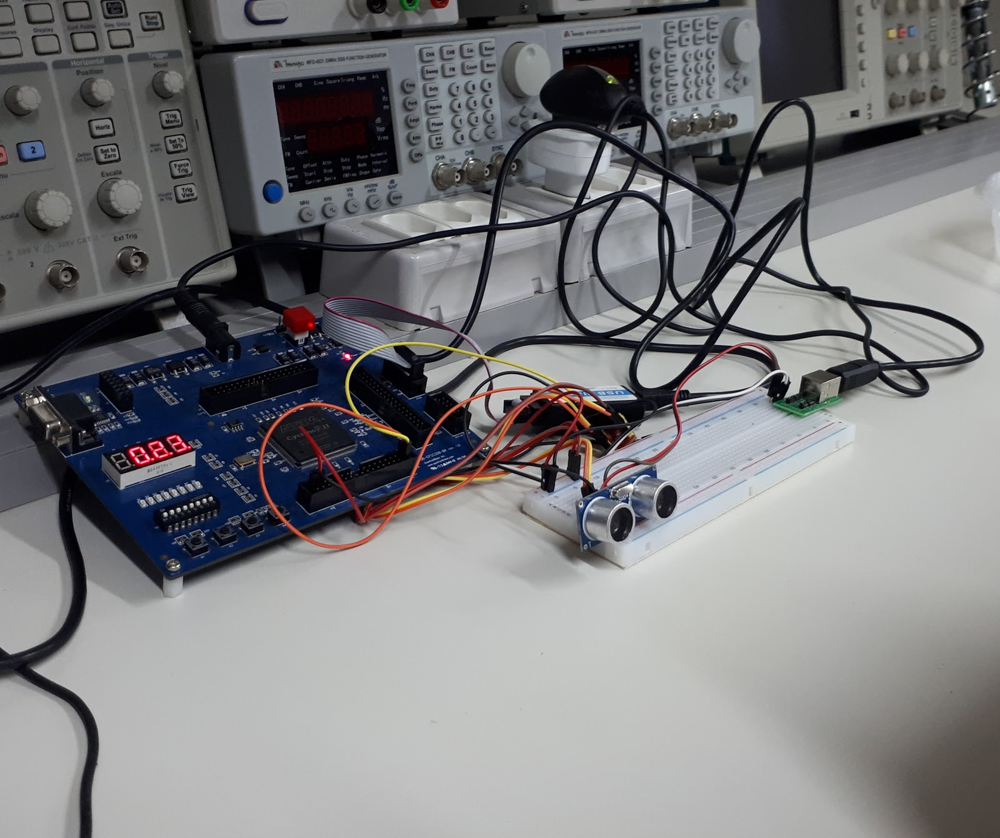

# :calling: ultrasonic-range-sensor

  

This repository is a college activity for the Laboratório de Sistemas Digitais (LSD), from Instituto Federal de Educação, Ciência e Tecnologia do Ceará (IFCE). The mainly goal is to build a ultrasonic distance sensor, using a Ultrasonic Ranging Module HC-SR04 and the QB-FPGA200EP2C Starter Kit.

## Sources
- [Digital Electronics - A Practical Approach With VHDL, 9th Edition, Willian Kleitz](https://www.amazon.com/Digital-Electronics-Practical-Approach-VHDL/dp/0132543036)
- [FPGA Prototyping by VHDL Examples, Pong P. Chu, 2007](https://www.amazon.com/FPGA-Prototyping-VHDL-Examples-Spartan-3/dp/0470185317)

## Acknowledgments
The modules were inspired in the following video, but with several changes:
- [How to Implement VHDL design for a Range sensor on an FPGA](https://www.youtube.com/watch?v=PJkiDAKVTFg)
